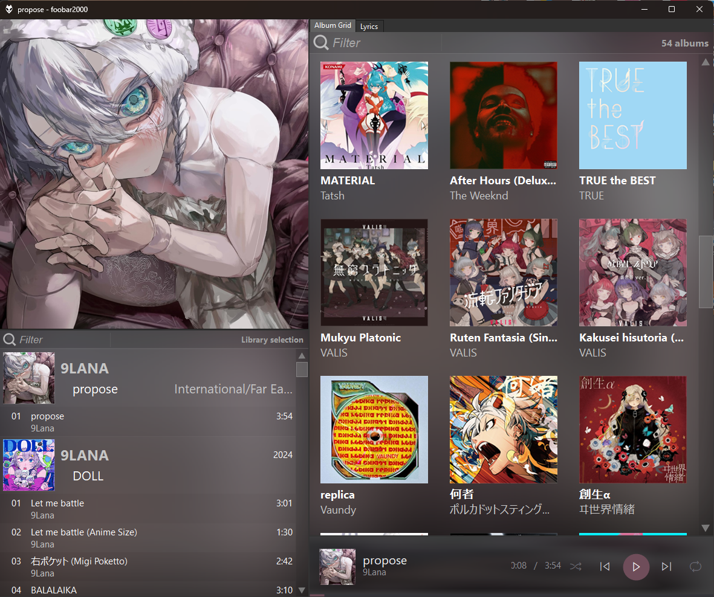
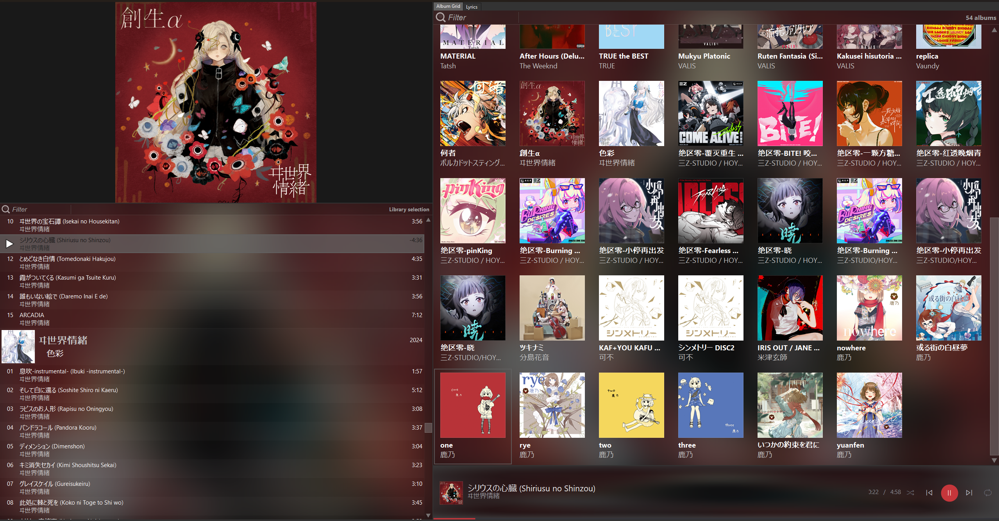
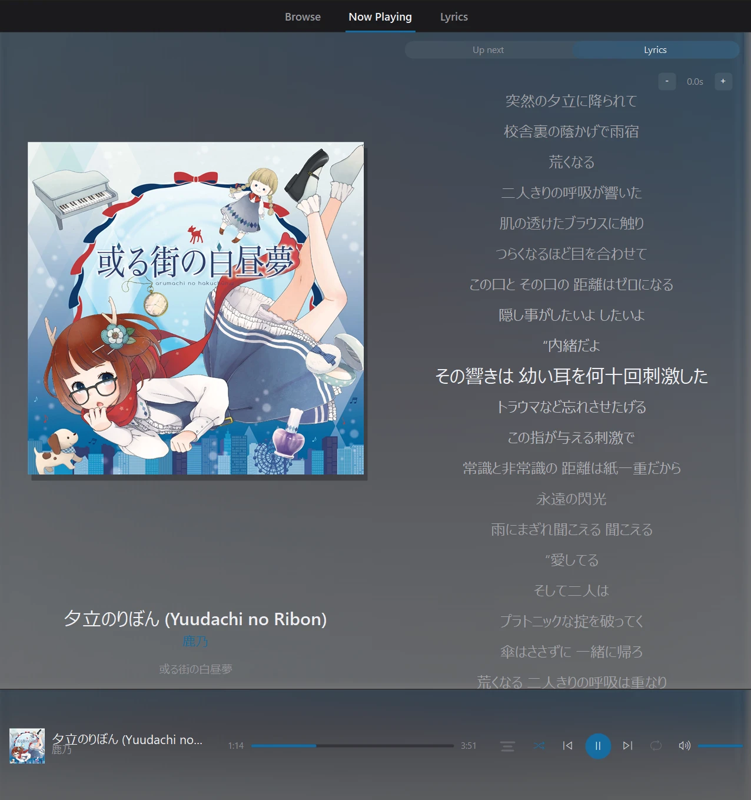

# foobar2000 setup

My foobar2000 UI + theme configuration — a portable install running **Columns UI** + **Spider Monkey Panel**, driven by a custom single-panel **Content Shell** (Browse / Now Playing / Lyrics with its own tab bar), a redesigned player bar, local synced lyrics, and Discord Rich Presence.

This repo holds only the **scripts and configs** — not the music library, not the ImgBB API key, and not the volatile foobar databases/caches.

## Versions

Three generations of this setup are kept, each a downloadable [release](https://github.com/snociloL/sno-foobar/releases):

| Version | UI | Get it |
|---------|----|--------|
| **v2-nowplaying** — current (`main`) | Content Shell — the **Now Playing** tab has an **Up next / Lyrics** toggle, so synced lyrics swap in for the playing queue | [release](https://github.com/snociloL/sno-foobar/releases/tag/v2-nowplaying) |
| **v1-classic** | Content Shell — Now Playing shows **only the queue**; lyrics on their own tab | [release](https://github.com/snociloL/sno-foobar/releases/tag/v1-classic) · [`classic` branch](https://github.com/snociloL/sno-foobar/tree/classic) |
| **v0-jssmooth** | The original **js-smooth** theme layout + the early player bar | [release](https://github.com/snociloL/sno-foobar/releases/tag/v0-jssmooth) |

Everything below describes the current **v2** (`main`) version.

## Showcase

Browse — album grid with the centered tab bar, plus Play all / Shuffle:

Now Playing — cover + the queue grouped by album header (art, year, genre):

Lyrics — synced, with the per-song sync-offset control (top-right):

## What's here

| Path | What it is |
|------|-----------|
| `smp_scripts/content_shell.js` | **The main UI** — one SMP panel that draws its own tab bar and hosts all three views (album grid, now-playing art + queue, synced lyrics) |
| `smp_scripts/player_bar.js` | Custom player bar — inline hover-scrub seekbar, volume slider, lyrics button, cover-derived accent |
| `smp_scripts/now_playing_art.js` | Legacy stand-alone now-playing art panel (superseded by the shell; kept for reference) |
| `foo_discord_rich/imgbb_upload.ps1` | Discord artwork uploader — posts covers to ImgBB, prints the URL (reads its key from `imgbb_key.txt`, which is **not** in this repo) |
| `js-smooth/{jssp,jssb,JScommon}.js` | Edited js-smooth theme scripts (used by the alternate js-smooth layout) |
| `configuration/*.cfg` | Component configs — Columns UI layout, SMP, OpenLyrics, Discord |
| `smp_icons/` | Legacy PNG icons (the bar now uses Segoe MDL2 glyphs) |

## Components to install first

Via **Preferences → Components**, then restore the files below:

- **Columns UI** (`foo_ui_columns`)
- **Spider Monkey Panel** (`foo_spider_monkey_panel`)
- **Discord Rich Presence** (`foo_discord_rich`)
- **OpenLyrics** (`foo_openlyrics`) — optional; used for on-demand lyric fetching that the shell then reads from disk

## Restore map

Let `PROFILE` = the foobar2000 profile folder (portable install: next to `foobar2000.exe`).

- `smp_scripts\*.js` → `PROFILE\smp_scripts\`
- `foo_discord_rich\imgbb_upload.ps1` → `PROFILE\foo_discord_rich\`
- `js-smooth\*.js` → `PROFILE\user-components\foo_spider_monkey_panel\samples\js-smooth\js\` *(overwrite the stock files)*
- `configuration\*.cfg` → `PROFILE\configuration\`

The SMP panels load a script via an `include('<abs path>\content_shell.js')` (or `player_bar.js`) line in the panel's Configure box — adjust the path to your install. Then restart foobar2000.

## Key customizations

**Content Shell** (`content_shell.js`): a single SMP panel with a centered **Browse / Now Playing / Lyrics** tab bar (built because Columns UI's native tab strip can't be restyled and SMP can't drive it).
- *Browse* — album grid over the library; click a cover for a drill-down album page (tracklist + Play/Shuffle); "Play all / Shuffle" pills.
- *Now Playing* — big cover + the playing queue grouped by album header (art, year, genre), playing row highlighted.
- *Lyrics* — synced `.lrc` reader with a per-song sync-offset nudge (top-right `[-] +0.0s [+]`, saved to `lyric_offsets.json`). Reads lyrics from, in order: a `.lrc`/`.txt` next to the track → `PROFILE\lyrics\` → the track's lyric tags.
- Covers pre-render at cell size and blit 1:1; fast interpolation while scrolling, HQ at rest; 60 fps. **All `include`d SMP files must be pure ASCII** (raw non-ASCII glyphs get mis-decoded — use `\uXXXX` escapes).

**Player bar** (`player_bar.js`): Segoe MDL2 transport glyphs; **accent + blurred backdrop derived per-track from the cover**; play/pause in an accent circle; **inline hover-scrub seekbar** with a seek-time bubble; **volume slider + mute**; a lyrics button that jumps the shell to the Lyrics tab (`window.NotifyOthers`). Fully responsive.

**Discord Rich Presence** — album art is uploaded to **ImgBB** (Discord no longer displays catbox.moe images, and Imgur removed anonymous uploads). Set it up:
1. Get a free ImgBB API key at <https://api.imgbb.com/>.
2. Create `PROFILE\foo_discord_rich\imgbb_key.txt` containing just that key (gitignored — keep it private).
3. Preferences → Discord Rich Presence → **Uploader** → *Custom command*:
   `"C:\Windows\System32\WindowsPowerShell\v1.0\powershell.exe" -NoProfile -ExecutionPolicy Bypass -File "PROFILE\foo_discord_rich\imgbb_upload.ps1" "{filepath}"`
   (use PowerShell's **full path** — a bare `powershell.exe` isn't resolved by foobar's launcher).

**js-smooth scripts** (alternate layout): year-only group-header date; genre no longer overlaps the cover; 60 fps scroll; disk-cache cover cap raised 200 → 500 px (clear `PROFILE\smp_smooth_cache\` after changing).

## Lyrics

Lyrics are local `.lrc` files the shell reads. Many were fetched from **lrclib.net** (Western/mainstream) and **NetEase** (`music.163.com`, for CJK/game music), matched by title + duration and saved next to each track. Purely instrumental tracks (e.g. game BGM) have none by design.

## Not included

- The music library (huge + not mine to distribute)
- `imgbb_key.txt` (secret), `lyric_offsets.json` (local), `image_hashes.json*` (cache), `*.log`, `smp_smooth_cache\`
- foobar databases: `metadb.sqlite`, `config.sqlite`, playlists

> The `.cfg` files are foobar's own binary format — they restore the setup but aren't human-diffable.
